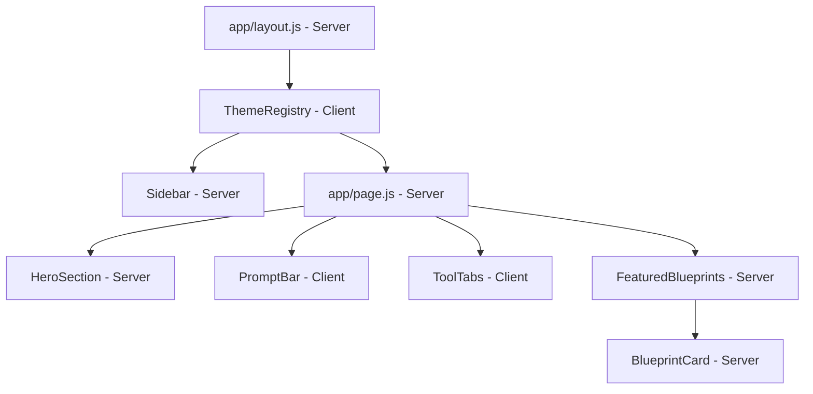

# Design: AI Creative Platform UI

## Overview

This feature implements a dark-themed AI creative platform homepage inspired by Leonardo.ai. The UI consists of a persistent dark sidebar navigation and a main content area with a hero section, prompt input bar, tool category tabs, and a featured blueprints section.

The stack is Next.js (App Router, JavaScript only), Material UI v5+ for all styling via `sx` props and `styled`, and Lucide React for icons. No TypeScript, no Tailwind, no inline styles.

---

## Architecture

The app uses Next.js App Router. Because MUI's Emotion-based CSS-in-JS requires a style registry for SSR, a `ThemeRegistry` Client Component wraps the app in the root layout. All interactive components (tabs, prompt input) are Client Components. Static/structural components can be Server Components.



### Server vs Client split

| Component | Type | Reason |
|---|---|---|
| `ThemeRegistry` | Client | Needs `useServerInsertedHTML` for Emotion SSR |
| `Sidebar` | Server | Static nav, no interactivity |
| `HeroSection` | Server | Static markup |
| `PromptBar` | Client | Controlled input + button click handler |
| `ToolTabs` | Client | Tab selection state (`useState`) |
| `FeaturedBlueprints` | Server | Static card grid |
| `BlueprintCard` | Server | Static card markup |

---

## Components and Interfaces

### `ThemeRegistry` (`src/app/components/ThemeRegistry.js`)

Client Component. Sets up MUI dark theme and Emotion cache with `useServerInsertedHTML` for SSR style flushing. Wraps children with `CssBaseline` and `ThemeProvider`.

```js
// Props: { children: ReactNode }
```

### `Sidebar` (`src/app/components/Sidebar.js`)

Renders the fixed left navigation. Accepts a `navItems` array prop (or uses a static constant internally).

```js
// navItem shape: { id, label, icon: LucideComponent, isNew?: boolean, href?: string }
```

Key sub-elements:
- Logo area at top
- Scrollable nav item list (icon + label + optional NEW chip)
- Upgrade button at bottom
- User avatar at bottom

### `HeroSection` (`src/app/components/HeroSection.js`)

Full-width section with a cinematic background image and the headline "YOURS TO CREATE". Background via MUI `Box` with `backgroundImage` in `sx`.

### `PromptBar` (`src/app/components/PromptBar.js`)

Client Component. Controlled `TextField` + `Button`. Manages `value` state locally. `onGenerate` callback prop for future integration.

```js
// Props: { onGenerate?: (prompt: string) => void }
```

### `ToolTabs` (`src/app/components/ToolTabs.js`)

Client Component. MUI `Tabs` + `Tab` components. Manages `activeTab` state. Each tab may have an optional NEW badge rendered as a MUI `Chip`.

```js
// tab shape: { id, label, isNew?: boolean }
```

### `FeaturedBlueprints` (`src/app/components/FeaturedBlueprints.js`)

Section header with "Featured Blueprints" title and "View More" link. Horizontally scrollable row of `BlueprintCard` components.

### `BlueprintCard` (`src/app/components/BlueprintCard.js`)

MUI `Card` with an image, title, and optional NEW badge chip overlay.

```js
// Props: { title, imageUrl, isNew?: boolean }
```

---

## Data Models

### Nav Item

```js
{
  id: string,        // unique key
  label: string,     // display label
  icon: Component,   // Lucide React icon component
  isNew: boolean,    // show NEW badge
  href: string,      // navigation target (# for placeholder)
}
```

### Tool Tab

```js
{
  id: string,
  label: string,
  isNew: boolean,
}
```

### Blueprint Card

```js
{
  id: string,
  title: string,
  imageUrl: string,  // path under /public or external URL
  isNew: boolean,
}
```

### MUI Theme

Dark theme created with `createTheme`:

```js
{
  palette: {
    mode: 'dark',
    primary: { main: '#c084fc' },   // purple accent
    background: {
      default: '#0f0f0f',
      paper: '#1a1a1a',
    },
  },
  typography: {
    fontFamily: 'var(--font-geist-sans), sans-serif',
  },
}
```

---

## File Structure

```
src/
  app/
    layout.js                        # Root layout — wraps with ThemeRegistry
    page.js                          # Homepage — composes all sections
    globals.css                      # Minimal resets only
    components/
      ThemeRegistry.js               # Client: MUI theme + Emotion SSR registry
      Sidebar.js                     # Server: sidebar nav
      HeroSection.js                 # Server: hero with background + headline
      PromptBar.js                   # Client: prompt input + generate button
      ToolTabs.js                    # Client: tool category tabs
      FeaturedBlueprints.js          # Server: blueprints section + cards
      BlueprintCard.js               # Server: individual blueprint card
    data/
      navItems.js                    # Static nav item definitions
      toolTabs.js                    # Static tab definitions
      blueprints.js                  # Static blueprint card data
```

---

## Correctness Properties

*A property is a characteristic or behavior that should hold true across all valid executions of a system — essentially, a formal statement about what the system should do. Properties serve as the bridge between human-readable specifications and machine-verifiable correctness guarantees.*

### Property 1: Sidebar nav items always have icon and label

*For any* nav item in the sidebar data array, the rendered sidebar should contain both a visible label text and an icon element for that item.

**Validates: Requirements 1.2**

### Property 2: Tab selection is exclusive

*For any* set of tool tabs, clicking a tab should result in exactly that tab being active and all other tabs being inactive.

**Validates: Requirements 3.3**

### Property 3: Blueprint cards render required fields

*For any* blueprint card data object with a title and imageUrl, the rendered `BlueprintCard` component should contain the title text and an image element. If `isNew` is true, a NEW badge should also be present.

**Validates: Requirements 4.2**

---

## Error Handling

- Missing blueprint `imageUrl`: render a placeholder background color via MUI `sx` fallback.
- Empty prompt submission: the Generate button should be disabled when the input is empty (checked via `value.trim() === ''`).
- Missing nav icon: guard with a conditional render; the label still renders.

---

## Testing Strategy

### Unit Tests (React Testing Library)

Focus on specific examples and edge cases:

- Sidebar renders all required nav items by label
- Blueprints nav item and Blueprints tab both show a NEW badge
- Hero section renders the headline "YOURS TO CREATE"
- Prompt input and Generate button are present
- Generate button is disabled when input is empty
- All tool tabs are rendered
- Featured Blueprints section renders heading and "View More" link

### Property-Based Tests (fast-check + React Testing Library)

Use [fast-check](https://github.com/dubzzz/fast-check) as the PBT library. Each property test runs a minimum of 100 iterations.

**Property 1: Sidebar nav items always have icon and label**
- Generate arbitrary arrays of nav item objects (with random labels and icon stubs)
- Render `Sidebar` with generated data
- Assert every label appears in the rendered output
- Tag: `Feature: ai-creative-platform-ui, Property 1: sidebar nav items always have icon and label`

**Property 2: Tab selection is exclusive**
- Generate an arbitrary list of tabs (min 2) and a random index to click
- Render `ToolTabs`, simulate click on the chosen tab
- Assert only that tab has the active/selected aria state
- Tag: `Feature: ai-creative-platform-ui, Property 2: tab selection is exclusive`

**Property 3: Blueprint cards render required fields**
- Generate arbitrary `{ title, imageUrl, isNew }` objects
- Render `BlueprintCard` with generated props
- Assert title text is present; assert NEW badge presence matches `isNew`
- Tag: `Feature: ai-creative-platform-ui, Property 3: blueprint cards render required fields`

Both unit and property tests are complementary: unit tests catch concrete layout bugs and specific badge requirements; property tests verify the general rendering contract holds across all possible data inputs.
